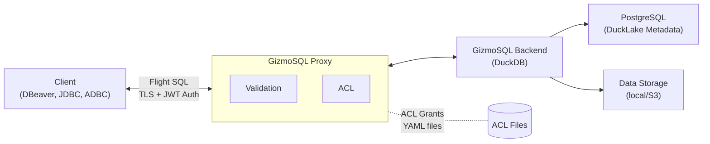

# Gizmo On-Demand

A multi-tenant platform for provisioning on-demand GizmoSQL database instances exposed through Apache Arrow Flight SQL. Each user or workload gets an isolated proxy+backend stack with authentication, SQL validation, and automatic lifecycle management.

## How It Works

```
                         +---------------------------+
                         |    Process Manager        |
                         |    REST API (:10900)      |
                         +-------------+-------------+
                                       |
                          Spawns N proxy instances
                                       |
                +----------+-----------+-----------+----------+
                |                      |                      |
     +----------v----------+  +-------v---------+  +---------v--------+
     | Proxy (:11900)      |  | Proxy (:11901)  |  | Proxy (:119XX)   |
     | FlightSQL + Auth    |  | FlightSQL + Auth |  | FlightSQL + Auth |
     | SQL Validation      |  | SQL Validation   |  | SQL Validation   |
     +----------+----------+  +--------+---------+  +---------+--------+
                |                      |                      |
     +----------v----------+  +--------v---------+  +---------v--------+
     | GizmoSQL (:12900)   |  | GizmoSQL (:12901)|  | GizmoSQL (:129XX)|
     | DuckLake (PG + S3)  |  | DuckLake (PG+S3) |  | DuckLake (PG+S3) |
     +---------------------+  +------------------+  +------------------+
```

The **Process Manager** is a REST API that provisions and manages proxy instances. Each **FlightSQL Proxy** authenticates users (Basic, Bearer/JWT, ODBC), validates SQL statements, and forwards queries to its dedicated **GizmoSQL backend** which connects to a DuckLake catalog (PostgreSQL metadata + S3/local data lake storage).

Two runtime backends are available:

- **Local mode** (default) -- Spawns OS processes with paired port allocation from a configurable range.
- **Kubernetes mode** -- Creates a Pod + Service per instance. Each pod runs the same container image internally. Pods are discoverable via cluster DNS and are automatically recovered if the Process Manager restarts.

Set `SL_GIZMO_RUNTIME_TYPE` to `local` or `kubernetes` to select the backend.

## Quick Start

### Prerequisites

- JDK 11+
- sbt (Scala Build Tool)
- Docker (for containerized deployment)

### Build

```bash
make build
# or
sbt assembly
```

The uber-jar is placed in `distrib/`.

### Run Locally

```bash
# Start the process manager
./local-start-process-manager.sh

# Create a proxy instance
./create-process.sh my-session

# List running instances
./list-processes.sh

# Stop an instance
./stop-process.sh my-session
```

### Run with Docker

```bash
# Build the image
make docker-build

# Run
make docker-run

# Or use the startup script directly
./docker-start-process-manager.sh
```

### Run with Kubernetes

```bash
export SL_GIZMO_RUNTIME_TYPE=kubernetes
export SL_GIZMO_K8S_NAMESPACE=my-namespace
export SL_GIZMO_K8S_IMAGE=starlakeai/gizmo-on-demand:latest
```

Each proxy instance is reachable at `gizmo-proxy-{name}.{namespace}.svc.cluster.local` on the configured proxy port. With `ClusterIP` (default), instances are only accessible within the cluster. Use `NodePort` or `LoadBalancer` for external access.

## API Reference

All endpoints except `/health` require the `X-API-Key` header when `SL_GIZMO_API_KEY` is set.

### Health Check

```
GET /health
```

```json
{"status": "ok", "message": "Gizmo On-Demand Process Manager is running"}
```

### Start a Process

```
POST /api/process/start
```

```json
{
  "processName": "my-session",
  "arguments": {
    "GIZMOSQL_USERNAME": "admin",
    "GIZMOSQL_PASSWORD": "secret",
    "SL_DB_ID": "my-project",
    "SL_DATA_PATH": "/data/ducklake_files/my-project",
    "PG_USERNAME": "postgres",
    "PG_PASSWORD": "pgpass",
    "PG_HOST": "localhost",
    "PG_PORT": "5432"
  }
}
```

Response:

```json
{
  "processName": "my-session",
  "port": 11900,
  "message": "Proxy Process started successfully on port 11900",
  "host": "127.0.0.1"
}
```

Optional fields: `connectionName`, `port` (request a specific port).

Additional arguments for S3-backed data lakes: `AWS_KEY_ID`, `AWS_SECRET`, `AWS_REGION`, `AWS_ENDPOINT`.

### Stop a Process

```
POST /api/process/stop
```

```json
{"processName": "my-session"}
```

### List Processes

```
GET /api/process/list
```

```json
{
  "processes": [
    {
      "processName": "my-session",
      "port": 11900,
      "pid": 12345,
      "status": "running",
      "host": "127.0.0.1"
    }
  ]
}
```

### Stop All Processes

```
POST /api/process/stopAll
```

## Connecting to a Proxy Instance

Once a proxy is running, connect with any Apache Arrow Flight SQL client (JDBC, ODBC, or native Flight).

**JDBC example:**

```
jdbc:arrow-flight-sql://localhost:11900?useEncryption=true&disableCertificateVerification=true
```

**Authentication:** Provide `GIZMOSQL_USERNAME` / `GIZMOSQL_PASSWORD` as the JDBC username/password. The proxy issues a JWT token on first authentication and accepts it for subsequent requests.

## Configuration

### Process Manager

| Variable | Default | Description |
|---|---|---|
| `SL_GIZMO_ON_DEMAND_HOST` | `0.0.0.0` | Host to bind the management API |
| `SL_GIZMO_ON_DEMAND_PORT` | `10900` | Port for the management API |
| `SL_GIZMO_MIN_PORT` | `11900` | Start of port range for spawned processes |
| `SL_GIZMO_MAX_PORT` | `12000` | End of port range for spawned processes |
| `SL_GIZMO_MAX_PROCESSES` | `10` | Maximum number of concurrent proxy instances |
| `SL_GIZMO_DEFAULT_SCRIPT` | `/opt/gizmosql/scripts/docker-start-sl-gizmosql.sh` | Script to start the backend GizmoSQL process |
| `SL_GIZMO_PROXY_SCRIPT` | `/opt/gizmosql/scripts/docker-start-proxy.sh` | Script to start the proxy process |
| `SL_GIZMO_API_KEY` | - | API key for authentication (recommended in production) |
| `SL_GIZMO_DATA_PATHS` | - | Space-separated absolute paths to mount as Docker volumes (for DuckLake local file stores) |
| `SL_GIZMO_IDLE_TIMEOUT` | `-1` | Idle timeout in seconds: `>0` stops backend after timeout, `<0` never stops (default), `=0` stops immediately after each request |
| `SL_GIZMO_RUNTIME_TYPE` | `local` | Runtime backend: `local` or `kubernetes` (also accepts `k8s`) |

### Kubernetes

When `SL_GIZMO_RUNTIME_TYPE=kubernetes`, each proxy instance is created as a Kubernetes Pod with a companion Service. The Pod runs the same Docker image and internally starts the proxy + backend as local processes.

| Variable | Default | Description |
|---|---|---|
| `SL_GIZMO_K8S_NAMESPACE` | `default` | Kubernetes namespace for pods and services |
| `SL_GIZMO_K8S_IMAGE` | `gizmo-proxy:latest` | Container image for proxy pods |
| `SL_GIZMO_K8S_SERVICE_ACCOUNT` | - | Service account name for the pods |
| `SL_GIZMO_K8S_PROXY_PORT` | `31338` | Fixed proxy port inside the pod |
| `SL_GIZMO_K8S_BACKEND_PORT` | `31337` | Fixed backend port inside the pod |
| `SL_GIZMO_K8S_SERVICE_TYPE` | `ClusterIP` | Kubernetes Service type (`ClusterIP`, `NodePort`, or `LoadBalancer`) |
| `SL_GIZMO_K8S_IMAGE_PULL_POLICY` | `IfNotPresent` | Image pull policy (`Always`, `IfNotPresent`, `Never`) |
| `SL_GIZMO_K8S_STARTUP_TIMEOUT` | `120` | Seconds to wait for a pod to become ready |

**Network visibility:** With `ClusterIP` (default), proxy instances are only reachable from within the cluster. Set to `NodePort` or `LoadBalancer` to expose them externally.

**Process recovery:** On startup, the Process Manager discovers existing pods labeled `managed-by=gizmo-process-manager` and re-registers them. This means a Process Manager restart does not orphan running proxy instances.

### Database Connection

These are passed as `arguments` when starting a process:

| Variable | Default | Description |
|---|---|---|
| `SL_DB_ID` | - | Starlake project / database identifier |
| `SL_DATA_PATH` | - | Path to DuckLake data files |
| `PG_HOST` | `host.docker.internal` | PostgreSQL metadata host |
| `PG_PORT` | `5432` | PostgreSQL metadata port |
| `PG_USERNAME` | `postgres` | PostgreSQL username |
| `PG_PASSWORD` | - | PostgreSQL password |

### GizmoSQL Backend

| Variable | Default | Description |
|---|---|---|
| `GIZMOSQL_USERNAME` | - | Username for GizmoSQL authentication |
| `GIZMOSQL_PASSWORD` | - | Password for GizmoSQL authentication |
| `JWT_SECRET_KEY` | - | Secret key for JWT token signing |
| `DATABASE_BACKEND` | `duckdb` | Database backend type |
| `DATABASE_FILENAME` | `data/TPC-H-small.duckdb` | Path to database file (`:memory:` for in-memory) |
| `TLS_ENABLED` | `0` | Enable TLS for backend (`0`/`1`) |
| `PRINT_QUERIES` | `1` | Log queries (`0`/`1`) |
| `READONLY` | `0` | Read-only mode (`0`/`1`) |
| `QUERY_TIMEOUT` | `0` | Query timeout in seconds (`0` = no timeout) |

### S3 Storage (Optional)

When DuckLake files are stored in S3-compatible storage, pass these as additional `arguments`:

| Variable | Description |
|---|---|
| `AWS_KEY_ID` | S3 access key ID |
| `AWS_SECRET` | S3 secret access key |
| `AWS_REGION` | S3 region |
| `AWS_ENDPOINT` | S3 endpoint URL (for MinIO or compatible services) |

### Proxy

These are typically set automatically by the Process Manager:

| Variable | Default | Description |
|---|---|---|
| `PROXY_HOST` | `0.0.0.0` | Proxy listen address |
| `PROXY_PORT` | `31338` | Proxy listen port |
| `PROXY_TLS_ENABLED` | `true` | Enable TLS for client connections |
| `PROXY_TLS_CERT_CHAIN` | `gizmosql-proxy/certs/server-cert.pem` | Path to TLS certificate chain |
| `PROXY_TLS_PRIVATE_KEY` | `gizmosql-proxy/certs/server-key.pem` | Path to TLS private key |
| `GIZMO_SERVER_HOST` | `127.0.0.1` | Backend GizmoSQL host |
| `GIZMO_SERVER_PORT` | `31337` | Backend GizmoSQL port |

### SQL Validation

| Variable | Default | Description |
|---|---|---|
| `VALIDATION_ENABLED` | `true` | Enable SQL statement validation |
| `VALIDATION_ALLOW_BY_DEFAULT` | `true` | Allow unrecognized statements (set `false` for deny-by-default) |
| `VALIDATION_BYPASS_USERS` | `admin` | Comma-separated list of users who bypass validation |

Default rules: `SELECT`, `INSERT`, and `UPDATE` (with `WHERE`) are allowed. `DROP DATABASE` and `DROP TABLE` are always denied.

## Idle Timeout

The backend GizmoSQL server supports three idle timeout modes:

| Mode | Config Value | Behavior |
|---|---|---|
| Disabled | `< 0` (default) | Backend runs indefinitely |
| Timed | `> 0` | Backend stops after N seconds of inactivity, automatically restarts on next query |
| Immediate | `= 0` | Backend stops after each request completes, restarts on next query |

The proxy remains running in all modes. Only the backend is stopped and restarted. This is useful for reducing resource consumption when instances are intermittently used.

## Docker Image

Published as `starlakeai/gizmo-on-demand` on Docker Hub.

Multi-platform: `linux/amd64`, `linux/arm64`.

```bash
# Publish snapshot
make docker-push-snapshot

# Publish release
make docker-push-release
```

The image is based on `gizmodata/gizmosql` and includes the GizmoSQL server binary, the Process Manager, proxy scripts, Java 21 JRE, and tini for proper signal handling.

## Development

```bash
make build          # Compile (sbt assembly)
make run            # Run locally (sbt run)
make test           # Run API tests
make clean          # Clean build artifacts

make docker-build   # Build Docker image
make docker-run     # Run container
make docker-stop    # Stop container
make docker-logs    # Tail container logs
```

## Further Documentation

- [Product Requirements Document](docs/PRD.md)
- [Architecture Document](docs/ARCHITECTURE.md)


# GizmoSQL Proxy - Flight SQL Proxy with Integrated Access Control

A Flight SQL (Apache Arrow) proxy server that intercepts SQL queries, applies validation rules and table-level Access Control Lists (ACLs) before forwarding them to a GizmoSQL/DuckDB backend. Designed for DuckLake environments with PostgreSQL metadata storage.

## Architecture



## Features

- **SQL statement validation** — blocks DROP, configurable allow/deny
- **Table-level ACL** with hierarchical grants (database -> schema -> table)
- **Multi-tenant ACL** with folder-based isolation
- **JWT authentication** with group-based permissions
- **TLS encryption** — auto-generated self-signed certificates for development
- **DuckLake integration** with PostgreSQL metadata
- **Optional S3 storage** for data files
- **Hot-reload of ACL grant files** via file watcher
- **On-demand backend process management** with idle timeout
- **Prepared statement validation**

## Prerequisites

- Java 17+ (JDK)
- Docker Desktop
- sbt (Scala build tool)
- PostgreSQL (for DuckLake metadata)
- openssl (for TLS certificate generation)

## Quick Start

```bash
# 1. Build the project
sbt assembly

# 2. Start the GizmoSQL backend (requires Docker)
./local-start-gizmo.sh

# 3. Start the proxy (in another terminal)
./local-start-proxy.sh

# 4. Connect with JDBC
# URL: jdbc:arrow-flight-sql://localhost:31338?useEncryption=true&disableCertificateVerification=true
```

## Key Environment Variables

| Variable | Default | Description |
|---|---|---|
| `PROXY_PORT` | `31338` | Proxy listen port |
| `GIZMO_SERVER_PORT` | `31337` | Backend GizmoSQL port |
| `SL_DB_ID` | — | DuckLake database name |
| `PG_HOST` | `host.docker.internal` | PostgreSQL host |
| `PG_USERNAME` | — | PostgreSQL username |
| `PG_PASSWORD` | — | PostgreSQL password |
| `ACL_ENABLED` | `true` | Enable/disable ACL validation |
| `ACL_BASE_PATH` | `/etc/gizmosql/acl` | Directory containing tenant ACL grants |
| `ACL_TENANT` | `default` | Active ACL tenant |
| `JWT_SECRET_KEY` | `a_very_secret_key` | JWT signing secret |

## Documentation

- [Getting Started](docs/quickstart.md) — Set up and run in 5 minutes
- [Usage Guide](docs/guide.md) — Architecture, deployment, and configuration walkthrough
- [Configuration Reference](docs/configuration.md) — All environment variables and settings
- [Access Control Lists](docs/acl.md) — ACL grants, tenants, and permissions
- [Connecting from DBeaver](docs/dbeaver.md) — Step-by-step DBeaver setup
- [Troubleshooting](docs/troubleshooting.md) — Common issues and solutions

## License

Apache 2.0