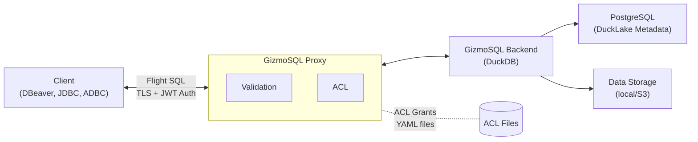

# GizmoSQL Proxy - Flight SQL Proxy with Integrated Access Control

A Flight SQL (Apache Arrow) proxy server that intercepts SQL queries, applies validation rules and table-level Access Control Lists (ACLs) before forwarding them to a GizmoSQL/DuckDB backend. Designed for DuckLake environments with PostgreSQL metadata storage.

## Architecture



## Features

- **SQL statement validation** — blocks DROP, configurable allow/deny
- **Table-level ACL** with hierarchical grants (database -> schema -> table)
- **Multi-tenant ACL** with folder-based isolation
- **JWT authentication** with group-based permissions
- **TLS encryption** — auto-generated self-signed certificates for development
- **DuckLake integration** with PostgreSQL metadata
- **Optional S3 storage** for data files
- **Hot-reload of ACL grant files** via file watcher
- **On-demand backend process management** with idle timeout
- **Prepared statement validation**

## Prerequisites

- Java 17+ (JDK)
- Docker Desktop
- sbt (Scala build tool)
- PostgreSQL (for DuckLake metadata)
- openssl (for TLS certificate generation)

## Quick Start

```bash
# 1. Build the project
sbt assembly

# 2. Start the GizmoSQL backend (requires Docker)
./local-start-gizmo.sh

# 3. Start the proxy (in another terminal)
./local-start-proxy.sh

# 4. Connect with JDBC
# URL: jdbc:arrow-flight-sql://localhost:31338?useEncryption=true&disableCertificateVerification=true
```

## Key Environment Variables

| Variable | Default | Description |
|---|---|---|
| `PROXY_PORT` | `31338` | Proxy listen port |
| `GIZMO_SERVER_PORT` | `31337` | Backend GizmoSQL port |
| `SL_DB_ID` | — | DuckLake database name |
| `PG_HOST` | `host.docker.internal` | PostgreSQL host |
| `PG_USERNAME` | — | PostgreSQL username |
| `PG_PASSWORD` | — | PostgreSQL password |
| `ACL_ENABLED` | `true` | Enable/disable ACL validation |
| `ACL_BASE_PATH` | `/etc/gizmosql/acl` | Directory containing tenant ACL grants |
| `ACL_TENANT` | `default` | Active ACL tenant |
| `JWT_SECRET_KEY` | `a_very_secret_key` | JWT signing secret |

## Documentation

- [Getting Started](docs/quickstart.md) — Set up and run in 5 minutes
- [Usage Guide](docs/guide.md) — Architecture, deployment, and configuration walkthrough
- [Configuration Reference](docs/configuration.md) — All environment variables and settings
- [Access Control Lists](docs/acl.md) — ACL grants, tenants, and permissions
- [Connecting from DBeaver](docs/dbeaver.md) — Step-by-step DBeaver setup
- [Troubleshooting](docs/troubleshooting.md) — Common issues and solutions

## License

Apache 2.0
