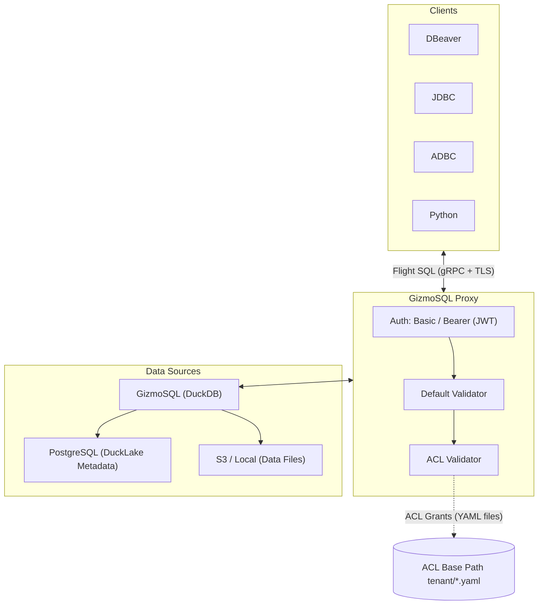
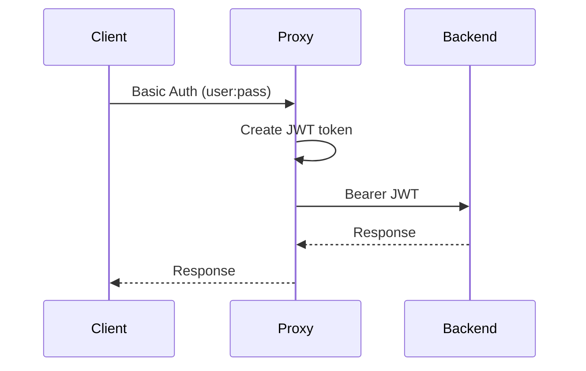
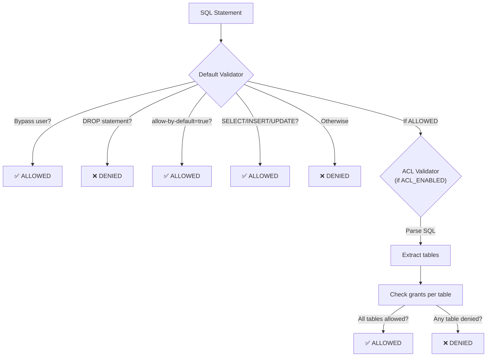

# Usage Guide

This guide covers the GizmoSQL Proxy architecture, deployment modes, and detailed configuration walkthrough. For a quick setup, see the [Getting Started](quickstart.md) guide first.

## Table of Contents

1. [Architecture](#architecture)
2. [Deployment Modes](#deployment-modes)
3. [Backend Configuration](#backend-configuration)
4. [Authentication](#authentication)
5. [SQL Validation](#sql-validation)
6. [ACL Integration](#acl-integration)
7. [TLS Configuration](#tls-configuration)
8. [Logging](#logging)
9. [Startup Scripts](#startup-scripts)
10. [Docker Deployment](#docker-deployment)
11. [On-Demand Process Manager](#on-demand-process-manager)

---

## Architecture

### Component Overview



### Request Lifecycle

1. **Client connects** via [Flight SQL](https://arrow.apache.org/docs/format/FlightSql.html) (gRPC) with Basic Auth or Bearer token
2. **Authentication middleware** validates credentials and creates/verifies JWT
3. **Client sends a query** — the proxy intercepts the Flight SQL command
4. **Protobuf deserialization** extracts the SQL statement from the Flight SQL command
5. **Default validation** checks basic rules (bypass users, DROP blocking, allow-by-default)
6. **ACL validation** (if enabled) parses the SQL, extracts table references, and checks grants
7. **If allowed**: the query is forwarded to the GizmoSQL backend
8. **If denied**: an `UNAUTHENTICATED` error is returned with the denial reason
9. **Backend processes the query** using DuckDB with DuckLake extensions
10. **Results are streamed back** to the client through the proxy

### Key Design Decisions

- **Composite validation**: The default validator and ACL validator are chained — the default runs first, then ACL. Both must allow the statement.
- **Per-user backend connections**: Each authenticated user gets their own backend Flight SQL client, stored in a `ConcurrentHashMap`.
- **Thread-local authentication**: Username and JWT claims are passed via `ThreadLocal` from the middleware to the validators.

---

## Deployment Modes

### Local Development

The simplest setup using the provided shell scripts:

```bash
# Terminal 1: Start the GizmoSQL backend (Docker)
./local-start-gizmo.sh

# Terminal 2: Start the proxy (JVM)
./local-start-proxy.sh
```

**Characteristics**:
- Backend runs in Docker, proxy runs on the JVM
- Self-signed TLS certificates auto-generated
- PostgreSQL can be on the host or in Docker
- ACL grants loaded from a local directory

### Docker (Single Container)

Build and run everything in a single Docker image:

```bash
# Build the image
docker build -t gizmosql-proxy .

# Run with environment variables
docker run -d \
  --name gizmosql-proxy \
  -p 10900:10900 \
  -p 11900-12000:11900-12000 \
  -e SL_DB_ID=mydb \
  -e PG_HOST=host.docker.internal \
  -e PG_USERNAME=ducklake \
  -e PG_PASSWORD=ducklake \
  -e SL_DATA_PATH=/data \
  -e SL_GIZMO_API_KEY=my-secret-key \
  -v /path/to/data:/data \
  -v /path/to/acl:/etc/gizmosql/acl \
  gizmosql-proxy
```

**Characteristics**:
- Uses the on-demand process manager as the entry point
- Backend instances are managed automatically (start/stop on demand)
- Single image contains both proxy and backend components
- Base image: `gizmodata/gizmosql` with Java 21 added

### Production

For production deployments, use proper TLS certificates and secure configuration:

```bash
docker run -d \
  --name gizmosql-proxy \
  -p 443:31338 \
  -e PROXY_TLS_ENABLED=true \
  -e PROXY_TLS_CERT_CHAIN=/certs/server.pem \
  -e PROXY_TLS_PRIVATE_KEY=/certs/server-key.pem \
  -e JWT_SECRET_KEY=$(openssl rand -hex 32) \
  -e SL_GIZMO_API_KEY=$(openssl rand -hex 32) \
  -e VALIDATION_ALLOW_BY_DEFAULT=false \
  -e LOG_STATEMENTS=false \
  -v /etc/ssl/certs:/certs:ro \
  -v /path/to/acl:/etc/gizmosql/acl:ro \
  gizmosql-proxy
```

**Production checklist**:
- [ ] Use proper TLS certificates (not self-signed)
- [ ] Change `JWT_SECRET_KEY` to a strong random value
- [ ] Change `SL_GIZMO_API_KEY` to a strong random value
- [ ] Set `VALIDATION_ALLOW_BY_DEFAULT=false`
- [ ] Set `LOG_STATEMENTS=false` (to avoid logging sensitive data)
- [ ] Use `strict` mode for ACL grants
- [ ] Mount ACL directory as read-only

---

## Backend Configuration

### DuckLake Architecture

The GizmoSQL Proxy is designed to work with [DuckLake](https://ducklake.select/) (an open lakehouse table format for [DuckDB](https://duckdb.org/)), which separates:
- **Metadata storage**: PostgreSQL (table definitions, schema, versioning)
- **Data storage**: Local filesystem or S3 (actual data files)

### INIT_SQL_COMMANDS Generation

At startup, the proxy generates SQL initialization commands for the backend. The placeholders below correspond to environment variables defined in the [Session configuration](configuration.md#session) ([`SL_DB_ID`](configuration.md#session), [`PG_HOST`](configuration.md#session), [`PG_PORT`](configuration.md#session), [`PG_USERNAME`](configuration.md#session), [`PG_PASSWORD`](configuration.md#session), [`SL_DATA_PATH`](configuration.md#session)). The template is:

```sql
INSTALL ducklake;
LOAD ducklake;
CREATE OR REPLACE PERSISTENT SECRET pg_{SL_DB_ID}
   (TYPE postgres, HOST '{PG_HOST}', PORT {PG_PORT},
    DATABASE {SL_DB_ID}, USER '{PG_USERNAME}', PASSWORD '{PG_PASSWORD}');
CREATE OR REPLACE PERSISTENT SECRET {SL_DB_ID}
   (TYPE ducklake, METADATA_PATH '', DATA_PATH '{SL_DATA_PATH}',
    METADATA_PARAMETERS MAP {'TYPE': 'postgres', 'SECRET': 'pg_{SL_DB_ID}'});
ATTACH IF NOT EXISTS 'ducklake:{SL_DB_ID}' AS {SL_DB_ID};
USE {SL_DB_ID};
```

The `{{placeholders}}` are replaced with environment variable values.

### S3 Storage

When AWS credentials are provided ([`AWS_KEY_ID`, `AWS_SECRET`, `AWS_REGION`, `AWS_ENDPOINT`](configuration.md#special-environment-variables)), an additional S3 secret is generated:

```sql
CREATE OR REPLACE PERSISTENT SECRET s3_{SL_DB_ID}
   (TYPE s3, KEY_ID '{AWS_KEY_ID}', SECRET '{AWS_SECRET}',
    REGION '{AWS_REGION}', ENDPOINT '{endpoint}',
    USE_SSL '{true|false}', URL_STYLE '{vhost|path}');
```

- **SSL** is auto-detected from the endpoint URL prefix (`https://` → enabled)
- **URL style** is `vhost` for `s3.amazonaws.com`, `path` for other endpoints (MinIO, etc.)

### Custom Init SQL

Use [`INIT_SQL_OVERRIDE`](configuration.md#special-environment-variables) to completely replace the generated SQL:

```bash
# Use a plain DuckDB database (no DuckLake)
export INIT_SQL_OVERRIDE="CREATE TABLE test AS SELECT 1 AS id;"

# Use a pre-existing DuckDB file
export INIT_SQL_OVERRIDE="ATTACH '/data/my_database.duckdb' AS mydb; USE mydb;"
```

---

## Authentication

### Authentication Flow



### Basic Auth

Clients send `Authorization: Basic <base64(username:password)>`. The proxy:

1. Decodes username and password
2. Creates a [JWT](https://datatracker.ietf.org/doc/html/rfc7519) token with claims: `sub` (username), `role` ("admin"), `auth_method` ("Basic")
3. Creates a backend client using the JWT as a Bearer token
4. Stores the username in `ThreadLocal` for validators

**[ODBC](https://learn.microsoft.com/en-us/sql/odbc/reference/what-is-odbc) compatibility**: The proxy handles the ODBC driver format `username};PWD={password`.

### Bearer Auth (JWT)

Clients send `Authorization: Bearer <jwt-token>`. The proxy:

1. Verifies the JWT signature using [`JWT_SECRET_KEY`](configuration.md#session)
2. Verifies the issuer is `"gizmosql"`
3. Extracts the `sub` claim as the username
4. Extracts all claims (including `groups`) for ACL
5. Creates a backend client using the same Bearer token

### Default Credentials

If [`GIZMOSQL_DEFAULT_USERNAME` and `GIZMOSQL_DEFAULT_PASSWORD`](configuration.md#backend-server) are set, they are used for clients that connect without credentials.

### Bypass Users

Users listed in [`VALIDATION_BYPASS_USERS`](configuration.md#statement-validation) (default: `["admin"]`) skip all validation, including ACL checks.

---

## SQL Validation

### Validation Pipeline

The proxy chains two validators:



### Default Validator Rules

1. If validation is disabled ([`VALIDATION_ENABLED`](configuration.md#statement-validation)`=false`): **ALLOWED**
2. If user is in [`bypass-users`](configuration.md#statement-validation): **ALLOWED**
3. If statement starts with `DROP DATABASE` or `DROP TABLE`: **DENIED**
4. If [`allow-by-default`](configuration.md#statement-validation) is `true`: **ALLOWED**
5. If statement is SELECT, INSERT, or UPDATE (with WHERE): **ALLOWED**
6. Otherwise: **DENIED**

### ACL Validator

See [Access Control Lists](acl.md) for complete documentation.

---

## ACL Integration

### How ACL Works in the Proxy

When ACL is enabled ([`ACL_ENABLED`](configuration.md#acl-access-control-lists)`=true`), the proxy creates an `AclStatementValidator` that:

1. **Reads tenant grants** from [`ACL_BASE_PATH`](configuration.md#acl-access-control-lists)`/`[`ACL_TENANT`](configuration.md#session)`/` (YAML files)
2. **Extracts user identity** from the authentication context (username + groups from [JWT](https://datatracker.ietf.org/doc/html/rfc7519))
3. **Sets SQL context** with `defaultDatabase` = [`SL_DB_ID`](configuration.md#session) and `dialect` = [`ACL_DIALECT`](configuration.md#acl-access-control-lists)
4. **Calls `aclSql.checkAccess()`** for every SQL statement
5. **Returns ALLOWED or DENIED** with a detailed reason

### Group Extraction

Groups are extracted from JWT claims:

1. **Primary**: The JWT claim named by [`ACL_GROUPS_CLAIM`](configuration.md#acl-access-control-lists) (default: `"groups"`)
   - JSON array: `["analysts", "data-team"]` → Set("analysts", "data-team")
   - Comma-separated string: `"analysts,data-team"` → Set("analysts", "data-team")
2. **Fallback**: If the groups claim is missing, the `"role"` claim is used as a single group

**Basic Auth note**: Users connecting with username/password get `role: "admin"` hardcoded in their JWT, resulting in the single group `{"admin"}`. See [ACL documentation](acl.md#user-identity--groups) for details.

### Validation Interception Points

The proxy intercepts SQL at two points in the Flight SQL protocol:

1. **`getFlightInfo()`** — Deserializes [`CommandStatementQuery`](https://arrow.apache.org/docs/format/FlightSql.html#query-execution) protobuf to extract the SQL
2. **`doAction("CreatePreparedStatement")`** — Deserializes [`ActionCreatePreparedStatementRequest`](https://arrow.apache.org/docs/format/FlightSql.html#prepared-statements) protobuf to extract the SQL

Both paths run the full validation pipeline (default + ACL) before forwarding.

---

## TLS Configuration

### Automatic Certificate Generation

The `local-start-proxy.sh` script automatically generates self-signed certificates:

```bash
# Generated in the certs/ directory:
# - certs/server-cert.pem (certificate, valid 365 days)
# - certs/server-key.pem  (private key, RSA 2048)
# - Subject: CN=localhost, with SAN: DNS:localhost, IP:127.0.0.1
```

Certificates are only generated if they don't already exist.

### Manual Certificate Setup

For production, provide your own certificates:

```bash
export PROXY_TLS_ENABLED=true
export PROXY_TLS_CERT_CHAIN=/path/to/cert-chain.pem
export PROXY_TLS_PRIVATE_KEY=/path/to/private-key.pem
```

### Disabling TLS

For development or testing:

```bash
# Using the startup script
./local-start-proxy.sh --with-no-tls

# Or via environment variables
export PROXY_TLS_ENABLED=false
```

### Backend TLS

To encrypt the proxy-to-backend connection:

```bash
export GIZMOSQL_TLS_ENABLED=true
export GIZMOSQL_TLS_CERT=/path/to/backend-ca.pem
```

---

## Logging

### Log Levels

Set via `LOG_LEVEL` (default: `INFO`):

| Level | What It Shows |
|---|---|
| `DEBUG` | Everything including protobuf parsing, validation details |
| `INFO` | Startup, connections, ACL decisions, SQL statements |
| `WARN` | Access denials, TLS fallbacks, stale caches |
| `ERROR` | Failures, connection errors, configuration problems |

### SQL Statement Logging

When `LOG_STATEMENTS=true` (default), all SQL statements are logged at INFO level:

```
>> Validating statement for user=alice, database=tpch2, peer=127.0.0.1
>> Statement: SELECT * FROM orders
```

### ACL Decision Logging

When `LOG_VALIDATION=true` (default), validation outcomes are logged:

```
ACL check: tenant=default, user=alice, groups=admin, database=tpch2
ACL ALLOWED: ALLOWED: SELECT on tpch2.public.orders (1 table, 0.45ms)
```

Or on denial:

```
ACL DENIED: DENIED: no matching grant for user 'alice' on tpch2.public.secret_table
Statement DENIED for user=alice: DENIED: no matching grant...
```

---

## Startup Scripts

### `local-start-proxy.sh`

The main proxy startup script. It:

1. **Parses CLI options** (`--with-no-tls`, `--help`)
2. **Generates TLS certificates** if TLS is enabled and certificates don't exist
3. **Sets default environment variables** for all configuration options
4. **Discovers the application JAR** in this order:
   - `/opt/gizmosql/manager/gizmo-on-demand.jar` (Docker)
   - `distrib/gizmo-on-demand-assembly-0.1.0-SNAPSHOT.jar` (assembly build output)
   - `target/scala-3.7.4/gizmo-on-demand-assembly-0.1.0-SNAPSHOT.jar` (sbt target)
5. **Starts the JVM** with `--add-opens=java.base/java.nio=ALL-UNNAMED` (required by Apache Arrow)
6. **Falls back to `sbt runMain`** if no JAR is found

#### Default Values Set by the Script

| Variable | Script Default |
|---|---|
| `PROXY_HOST` | `0.0.0.0` |
| `PROXY_PORT` | `31338` |
| `GIZMO_SERVER_HOST` | `localhost` |
| `GIZMO_SERVER_PORT` | `31337` |
| `VALIDATION_ENABLED` | `true` |
| `VALIDATION_ALLOW_BY_DEFAULT` | `false` |
| `LOG_LEVEL` | `DEBUG` |
| `SL_DB_ID` | `tpch2` |
| `PG_HOST` | `host.docker.internal` |
| `PG_USERNAME` | `ducklake` |
| `PG_PASSWORD` | `ducklake` |
| `GIZMOSQL_USERNAME` | `gizmosql_username` |
| `GIZMOSQL_PASSWORD` | `gizmosql_password` |

> **Note**: The script defaults may differ from the `application.conf` defaults. Script values override `application.conf` values.

#### Debug Mode

Uncomment the debug agent line in the script to enable remote debugging:

```bash
AGENT_LIB="-agentlib:jdwp=transport=dt_socket,server=y,suspend=n,address=*:5005"
```

Then attach a debugger to port 5005.

### `local-start-gizmo.sh`

Starts the GizmoSQL backend in Docker:

1. **Runs the Docker container** with the `starlakeai/gizmo-on-demand:latest` image
2. **Configures the backend** with environment variables (port, credentials, init SQL)
3. **Uses in-memory DuckDB** (`DATABASE_FILENAME=:memory:`)
4. **Mounts `/private/tmp:/data`** for temporary data storage
5. **Runs DuckLake initialization** via `INIT_SQL_COMMANDS`

#### Customizing Init SQL

The default `INIT_SQL_COMMANDS` sets up DuckLake with PostgreSQL. Override for custom setups:

```bash
export INIT_SQL_COMMANDS="CREATE TABLE test(id INT, name VARCHAR); INSERT INTO test VALUES (1, 'hello');"
./local-start-gizmo.sh
```

---

## Docker Deployment

### Dockerfile Overview

The project uses a multi-stage Docker build:

**Build stage** (`eclipse-temurin:17-jdk-jammy`):
- Installs sbt
- Downloads dependencies (cached layer)
- Builds the assembly JAR

**Runtime stage** (`gizmodata/gizmosql:${GIZMO_VERSION}`):
- Based on the GizmoSQL image (includes [DuckDB](https://duckdb.org/) with extensions)
- Adds Java 21 runtime and [`tini`](https://github.com/krallin/tini) (lightweight init process for containers)
- Copies the assembly JAR and startup scripts
- Entry point: on-demand process manager

### Building the Image

```bash
# Default build (GizmoSQL v1.15.2-slim)
docker build -t gizmosql-proxy .

# With a specific GizmoSQL version
docker build --build-arg GIZMO_VERSION=v1.15.2-slim -t gizmosql-proxy .
```

### Exposed Ports

| Port | Purpose |
|---|---|
| `10900` | On-demand process manager API |
| `11900-12000` | Range for managed backend processes |

### Running with Docker

```bash
docker run -d \
  --name gizmosql \
  -p 10900:10900 \
  -p 11900-12000:11900-12000 \
  -e SL_DB_ID=mydb \
  -e PG_HOST=host.docker.internal \
  -e PG_USERNAME=ducklake \
  -e PG_PASSWORD=ducklake \
  -e SL_DATA_PATH=/data \
  -e SL_GIZMO_API_KEY=my-secret-key \
  -e ACL_BASE_PATH=/etc/gizmosql/acl \
  -v /path/to/data:/data \
  -v /path/to/acl:/etc/gizmosql/acl:ro \
  gizmosql-proxy
```

---

## On-Demand Process Manager

The on-demand manager (`ai.starlake.gizmo.ondemand.Main`) controls the lifecycle of GizmoSQL backend processes.

### Features

- **Dynamic process creation**: Backend instances are started on-demand when clients connect
- **Port management**: Assigns ports from the configured range (`SL_GIZMO_MIN_PORT` to `SL_GIZMO_MAX_PORT`)
- **Idle timeout**: Automatically stops inactive backends
- **Process limit**: Caps the number of concurrent backend processes

### Idle Timeout Behavior

| Value | Behavior |
|---|---|
| `-1` (default) | Never stop — backend runs indefinitely |
| `0` | Stop immediately after each request completes |
| `> 0` | Stop after N seconds of inactivity |

### API Key

The manager REST API requires authentication via `SL_GIZMO_API_KEY`. Set this to a strong random value in production.

---

## See Also

- [Getting Started](quickstart.md) — Quick setup guide
- [Configuration Reference](configuration.md) — All environment variables
- [Access Control Lists](acl.md) — ACL grants, tenants, and permissions
- [Connecting from DBeaver](dbeaver.md) — Client setup guide
- [Troubleshooting](troubleshooting.md) — Common issues and solutions
